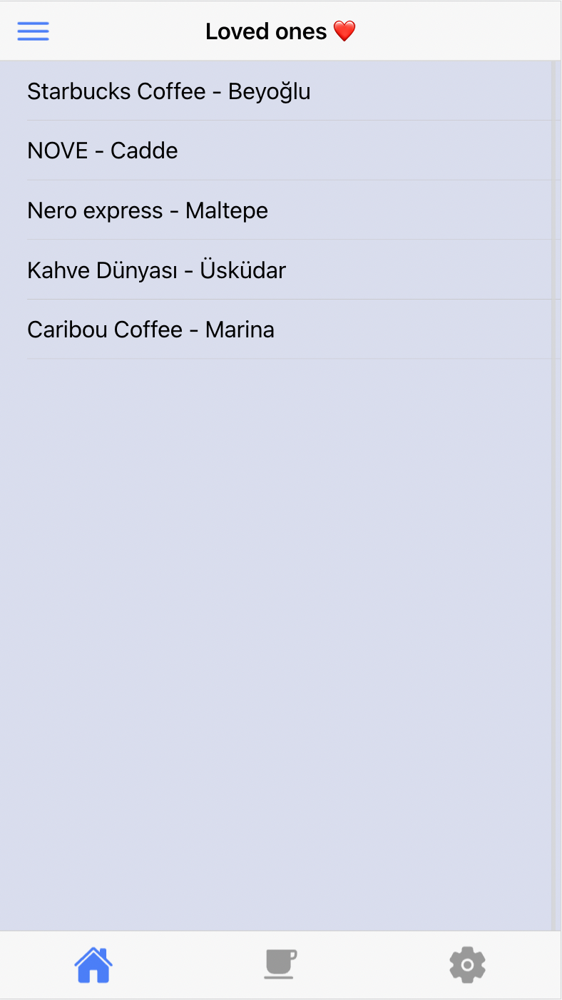
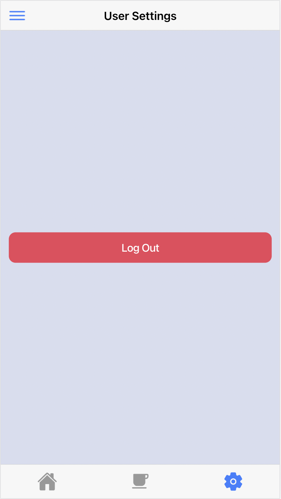

# Backend WnTc
As a developer, who is working remotely I always needed such a place where I can look for places to work at. There is such apps with similar usage and features but they are not specifically listing places to work. So, I wanted to create an app that suits those needs.


## ⚒ How To?

To develope a mobile application with Ionic framework we have couple of things to do before we start. Let me describe each of those steps in particular;
 - Node environment setup
 - Ionic setup
 - Development
 - Debug & Build

#### ⚙️ Node environment setup
For OSX environment you can install the node environment within the use of following commands
```
$ brew update
$ brew install node
```
if you are not on OSX environment or looking for more advanced installation follow this [article](https://www.newline.co/@Adele/how-to-install-nodejs-and-npm-on-macos--22782681).

#### 🧾 Ionic setup

Following command will install the ionic framework for you
```
$ npm install -g @ionic/cli
```
If it did not worked for you, you can always check official [documentation](https://ionicframework.com/docs/intro/cli).

#### 💻 Development

to create a new ionic application, below command will work for you!
```
$ ionic start <app name> <template: tabs | sidemenu | blank>
```

I preferred React framework for frontend side. You may prefer another supported framework.

#### 🏠 Debug & Build
We already got our application running on our local machine on browser, but what if we want to check it on an emulator or on a real mobile phone? Ionic is using [Capacitor](https://capacitorjs.com/) for this job. You do not need to install another source to accomplish this, Ionic brings it along!

> To use emulator xcode and all of the essentials should be installed, for android build Android Studio and SDK's are needed

```
$ ionic capacitor build ios
```

Above command will ask for what device you want to emulate on and then will bring the selected iOS device running your application.


## 📸 Screenshots 
See below to have a better understanding of this app!

<p float="left">
  
  
  
  
</p>
